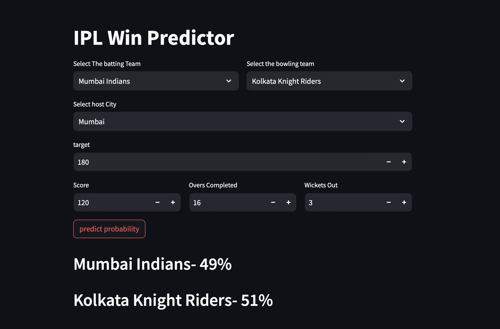

# IPL Win Predictor

## Overview
The IPL Win Predictor is a web application based on logistic regression. It allows users to predict the probability of a cricket team winning an IPL match based on various input parameters such as batting team, bowling team, host city, target score, overs completed, and wickets out.

Make sure to install the required libraries by running:

```bash
pip install streamlit pandas
```

## Input Parameters

- **Batting Team:** Select the batting team from the available options.
- **Bowling Team:** Select the bowling team from the available options.
- **Host City:** Select the host city for the match.
- **Target Score:** Input the target score for prediction.
- **Score, Overs Completed, Wickets Out:** Enter the current match details.

## Prediction

- Click the "Predict Probability" button to calculate the winning and losing probabilities for the selected teams.
- The results will be displayed, showing the predicted probabilities for both the batting and bowling teams.

**Note:** Ensure that the batting and bowling teams are different; otherwise, a warning will be displayed.

Feel free to explore and experiment with different input values to see how they affect the predicted probabilities.

### Result Display


## Model Information

The predictive model is based on logistic regression and is loaded using the `pickle` library from the saved `pipe.pkl` file.

## Credits

This project was created by Aditya Vashishta , Sarthak Gautam [https://github.com/Sarthakk011] , Sachin Sushil Singh [https://github.com/Liquidator420]as part of the Machine Learning Lab at TIET , Patiala. The logistic regression model is trained on historical IPL match data to make predictions.